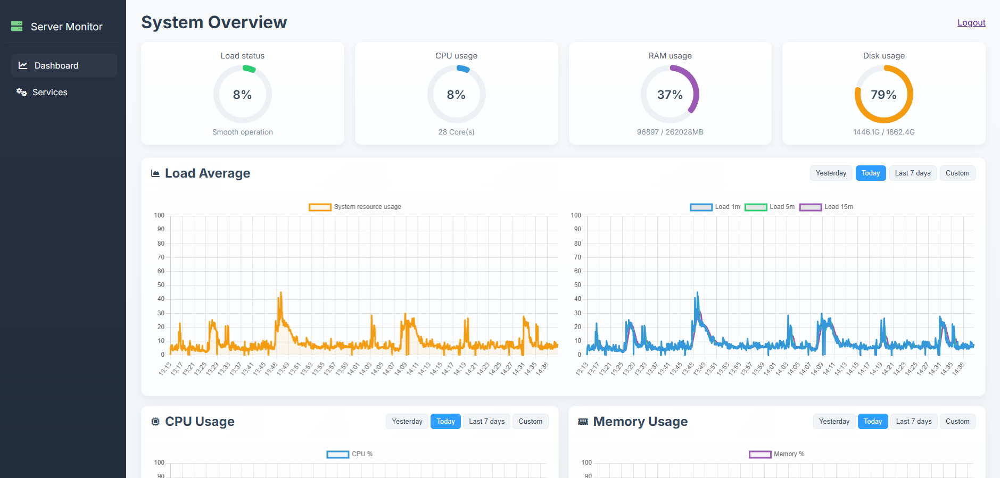

# System Monitor

Lightweight server monitoring and service management web UI built with Flask and psutil.

This repository provides a simple dashboard to view CPU / memory / disk / network statistics, history sampling, and a services management page. It was designed to be installed on Ubuntu servers but should run on any Linux system with Python 3 and the required packages.

Demo
----


Contents
--------
- `app.py` - Flask application entrypoint (serves API and UI).
- `monitor.py` - Sampling and persistence of system snapshots (SQLite).
- `templates/` and `static/` - Frontend UI (HTML, CSS, JS).
- `scripts/install_ubuntu.sh` - Opinionated installer for Ubuntu (creates venv, system user, systemd service).
- `scripts/system-monitor.service` - systemd unit template.
- `README_INSTALL.md` - Detailed installation guide (automated and manual steps).

Quick start (development)
-------------------------
These steps let you run the app locally for development or testing.

1. Create a Python virtual environment and install dependencies:

```bash
python3 -m venv venv
source venv/bin/activate
pip install -r requirements.txt
```

2. Run the application:

```bash
python app.py
```

By default the app binds to `127.0.0.1:5000`. Open `http://127.0.0.1:5000/` in your browser.

Notes about production installation on Ubuntu
--------------------------------------------
For production we recommend using the provided installer or setting up a systemd service and a reverse proxy (nginx) with TLS.

- Automated installer (runs as root):

```bash
sudo bash scripts/install_ubuntu.sh --dir /opt/system-monitor --port 5000
```

This will:
- Install system packages (python3, python3-venv, pip, git, ufw)
- Create a system user `monitor` and deploy the code to `/opt/system-monitor`
- Create a Python virtualenv and install dependencies from `requirements.txt`
- Install and start a systemd service `/etc/systemd/system/system-monitor.service`

- Manual systemd installation (alternative):

```bash
sudo cp scripts/system-monitor.service /etc/systemd/system/system-monitor.service
sudo systemctl daemon-reload
sudo systemctl enable --now system-monitor.service
sudo journalctl -u system-monitor.service -f
```

Service control and permissions
------------------------------
If you want the web UI to control system services (start/stop/restart), you have two safe options:

1. Grant the `monitor` user explicit sudo permissions for the exact `systemctl` commands you need (recommended). Edit the sudoers file with `visudo` and add a line such as:

```
monitor ALL=(ALL) NOPASSWD: /bin/systemctl start nginx, /bin/systemctl stop nginx, /bin/systemctl restart nginx
```

Use precise service names where possible to avoid wildcards. Wildcards can be used but widen scope.

2. (Not recommended) Run the service as `root` by adjusting the `User`/`Group` fields in the systemd unit.

Reverse proxy and TLS
---------------------
Put the app behind nginx (proxy to `http://127.0.0.1:5000`) and use certbot to obtain TLS certificates for production.

Troubleshooting
---------------
- Check service status and logs:

```bash
sudo systemctl status system-monitor.service
sudo journalctl -u system-monitor.service -n 200
```

- If pages are blank or JS fails, open the browser DevTools console and look for 404s or JS errors. Confirm `/static/` assets are served.

Security & privacy
------------------
- This project accesses system metrics and optionally can run privileged commands (systemctl). Carefully limit sudo privileges and run behind authentication when exposing to untrusted networks.

Contributing
------------
Contributions welcome. Please open issues or pull requests for bugs and improvements. Keep changes small and include tests where appropriate.

License
-------
This project is provided under the MIT License. See `LICENSE` if present.

Contact
-------
If you need help with deployment, include logs from `journalctl` and any output from the installer when opening an issue.
